### Test 1 from (splashscreen to instance_homepage_ai-reaction)

- splashscreen -> UnTested

  

- homepage -> UnTested

  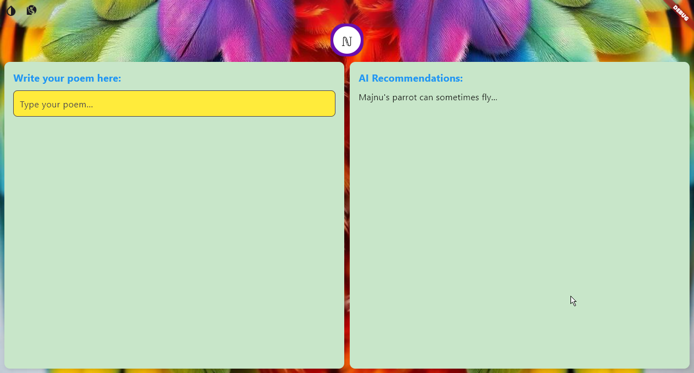

- action_switchprompt -> UnTested

  (No image found)

- instance_homepage_ai-reaction -> UnTested

  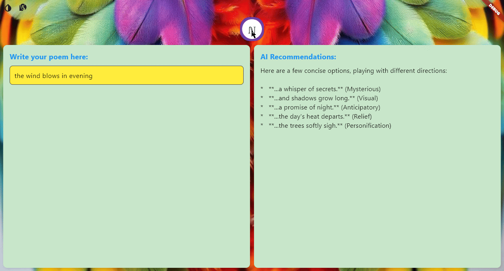

### Test 2 from (splashscreen to instance_homepage_ai_updates_result_accordingly)

- splashscreen -> UnTested

  

- homepage -> UnTested

  

- action_write some text -> UnTested

  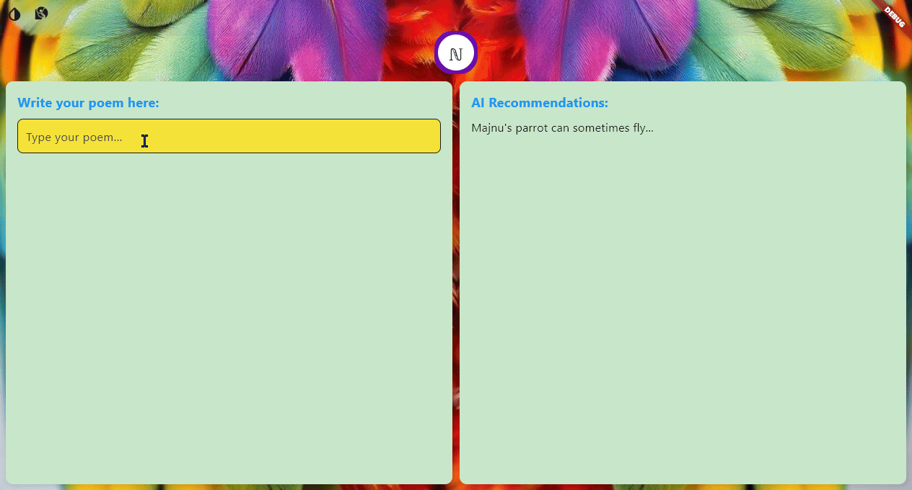

- instance_homepage-ai-result -> UnTested

  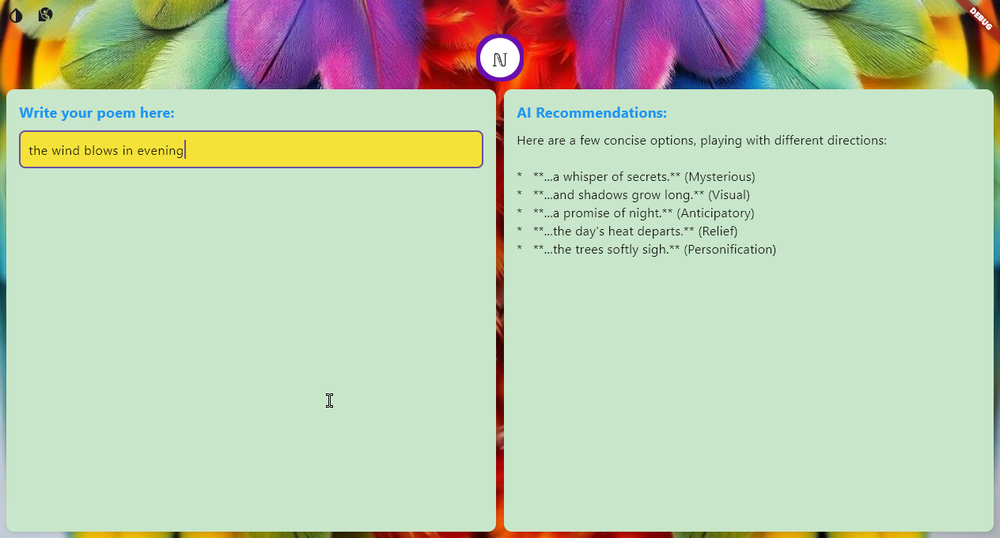

- action_switch-prompt -> UnTested

  (No image found)

- instance_homepage-new-ai-result -> UnTested

  

- action_user_selects_section -> UnTested

  (No image found)

- instance_homepage_ai_updates_result_accordingly -> UnTested

  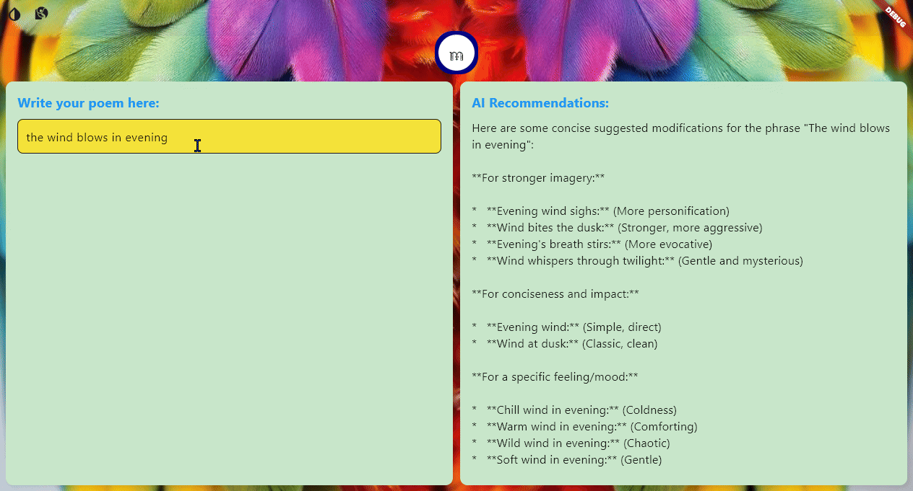

### Test 3 from (splashscreen to instance_color_scheme_changes)

- splashscreen -> UnTested

  

- homepage -> UnTested

  

- action_press_on_color-scheme_icon -> UnTested

  (No image found)

- instance_color_scheme_changes -> UnTested

  

### Test 4 from (splashscreen to variant_dialog_retains_context)

- splashscreen -> UnTested

  

- homepage -> UnTested

  

- action_press_add_context_icon -> UnTested

  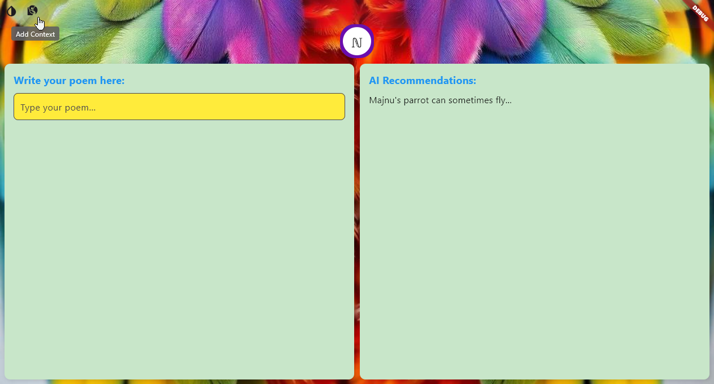

- variant_context_dialog_shows -> UnTested

  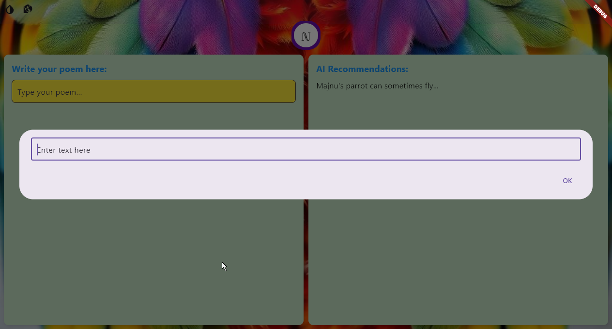

- action_user_writes_context -> UnTested

  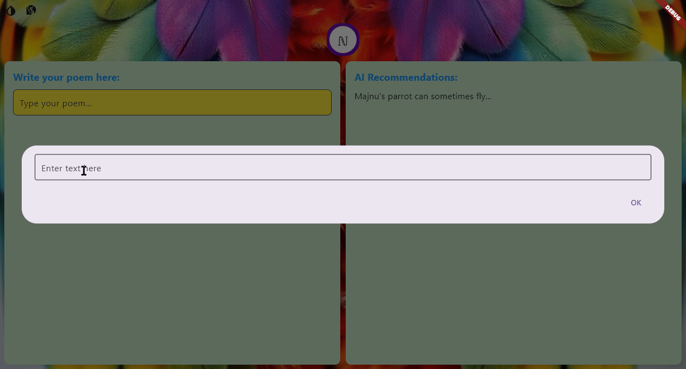

- action_user_press_ok -> UnTested

  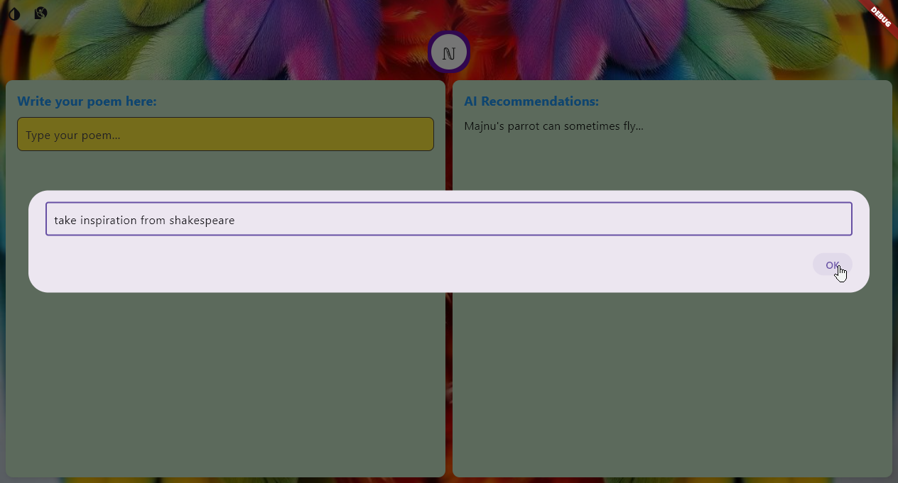

- instance_homepage_ai_changes_results_accordingly -> UnTested

  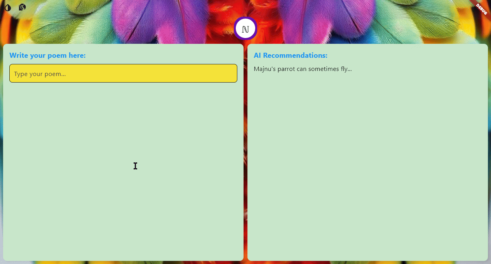

- action_user_press_context_icon (2nd time) -> UnTested

  .png)

- variant_dialog_retains_context -> UnTested

  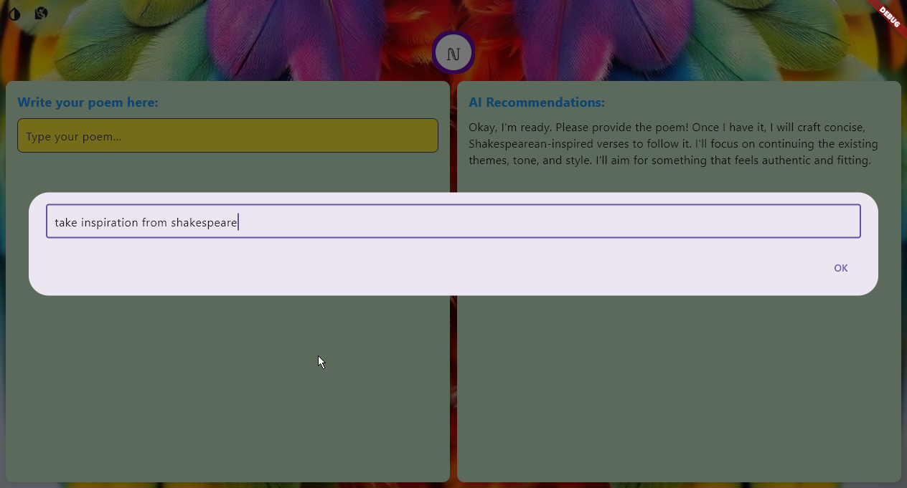

### Test 5 from (splashscreen to instance_homepage_ai_changes_results_update)

- splashscreen -> UnTested

  

- homepage -> UnTested

  

- action_press_add_context_icon -> UnTested

  

- variant_context_dialog_shows -> UnTested

  

- action_user_writes_context -> UnTested

  

- action_user_press_ok -> UnTested

  

- instance_homepage_ai_changes_results_accordingly -> UnTested

  

- action_user_writes_some_text (2) -> UnTested

  .png)

- instance_homepage_ai_changes_results_update -> UnTested

  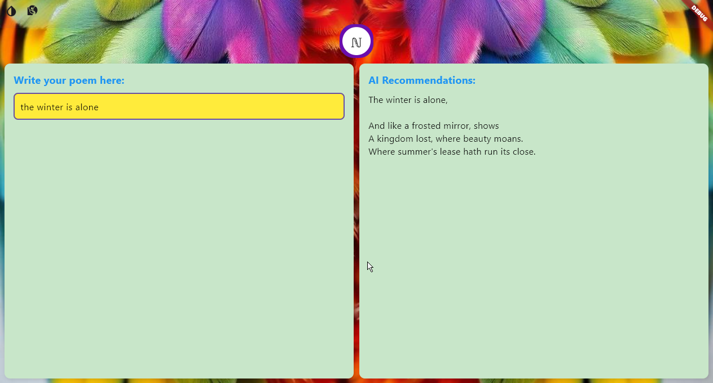

